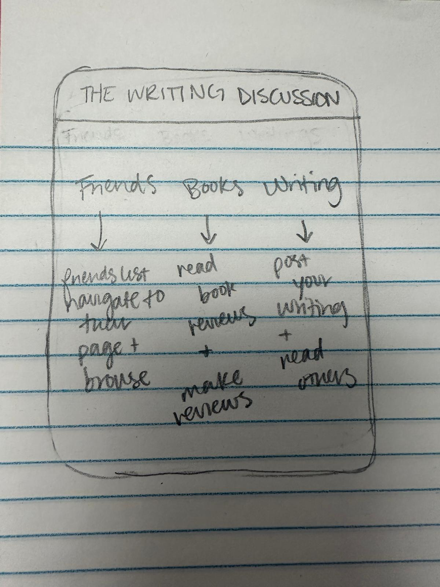
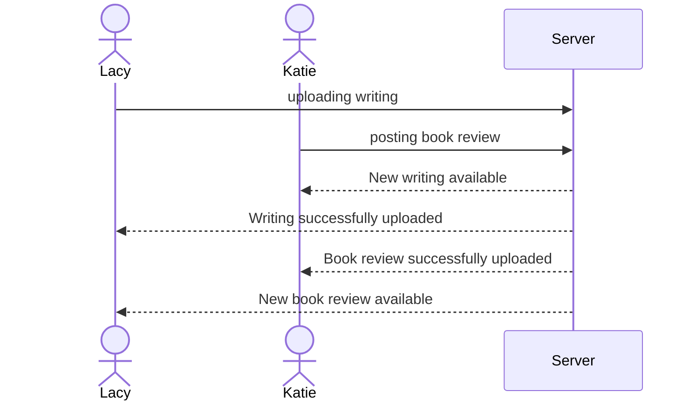

# The Writing Discussion

The Writing Discussion will be an online forum for book lovers to review books that they could possibly recommend. You can connect with friends to see their active readings. As well new writers can post their drafts and writings and get feedback from trusted readers whose opinions they value.

## 🚀 Specification Deliverable

For this deliverable I did the following. I checked the box `[x]` and added a description for things I completed.

- [x] Proper use of Markdown
- [x] A concise and compelling elevator pitch
- [x] Description of key features
- [x] Description of how you will use each technology
- [x] One or more rough sketches of your application. Images must be embedded in this file using Markdown image references.

### Elevator pitch

Have you ever been a scared new writer who really wants to make their way in the world but has no idea how people will react? 
Have you ever been stuck trying to find a good book to read on a rainy day? Have you ever been so upset with the ending of your book 
you just need to talk to someone about it? These are all amazing reasons to use The Writing Discussion platform. 
With the ability to upload the newest snippet of your latest novel, the ability to read reviews and ratings from close friends 
and their most recently read books and the friends to talk to when the main character really makes you upset you'll never get 
tired of using The Writing Discussion platform. 

### Design

There will be 3 separate options on which to pick. Whether you want to communicate or look at friends activity. Whether you want to browse or review a book. And, whether you want to upload a writing or review someone elses writing. From there it gets more specific and you can navigate through each of those options and have your own page to look at your activity.

### Key features

- Secure login over HTTPS
- Displays choices that can be used to navigate to new pages
- Ability to publish private work
- Ability to communicate online with with friends
- Ability to post comments and reactions to book
- Ability to view others posts on books and personal work
- Totals up the number of books reviewed and read
- Ability for admin delete or edit posts

### Technologies

I am going to use the required technologies in the following ways.

- **HTML** - Several pages used with correct HTML structure. One page for books, one page for reviews, and one page for personal writings.
- **CSS** - Application styling that fits on different sceen sizes, with color contrasting to highlight separate functions.
- **React** - Provides login, choice for page display, display writings and books, communicating with friends
- **Service** - Backend service with endpoints:
    - login
    - posting work for books
    - posting work for writings
    - communicate with friends
    - grouping books read with ratings
- **DB/Login** - Store users, books read, writings uploaded in database. Register and login users. 
Credentials stored securely in database. Cannot participate unless authenticated.
- **WebSocket** - As each review or writing is uploaded it is viewable to others as well as comments and other chats.

## 🚀 AWS deliverable

For this deliverable I did the following. I checked the box `[x]` and added a description for things I completed.

- [x] **Server deployed and accessible with custom domain name** - [My server link](https://webprogramming.click).

## 🚀 HTML deliverable

For this deliverable I did the following. I checked the box `[x]` and added a description for things I completed.

- [X] **HTML pages** - I have 4 HTML pages. One home page, one for writings one for books and one to make posts.
- [X] **Proper HTML element usage** - I used the different HTML elements properly having a heading on every page, a footer linked to my github and the main part of my page.
- [X] **Links** - The login page automatically links to the users personal posting page.
- [X] **Text** - There is text explaining the page and for each review
- [ ] **3rd party API placeholder** - I did not complete this part of the deliverable.
- [X] **Images** - There is an image on the front page and included as an option in the reviews.
- [X] **Login placeholder** - There is a login on my home page with a placeholder
- [X] **DB data placeholder** - The writings and book reviews posted by user have a placeholder for where they will be stored. 
- [X] **WebSocket placeholder** - There will be writings and reviews able to be viewed in the browse section in real time.

## 🚀 CSS deliverable

For this deliverable I did the following. I checked the box `[x]` and added a description for things I completed.

- [ ] **Header, footer, and main content body** - I did not complete this part of the deliverable.
- [ ] **Navigation elements** - I did not complete this part of the deliverable.
- [ ] **Responsive to window resizing** - I did not complete this part of the deliverable.
- [ ] **Application elements** - I did not complete this part of the deliverable.
- [ ] **Application text content** - I did not complete this part of the deliverable.
- [ ] **Application images** - I did not complete this part of the deliverable.

## 🚀 React part 1: Routing deliverable

For this deliverable I did the following. I checked the box `[x]` and added a description for things I completed.

- [ ] **Bundled using Vite** - I did not complete this part of the deliverable.
- [ ] **Components** - I did not complete this part of the deliverable.
- [ ] **Router** - Routing between login and voting components.

## 🚀 React part 2: Reactivity

For this deliverable I did the following. I checked the box `[x]` and added a description for things I completed.

- [ ] **All functionality implemented or mocked out** - I did not complete this part of the deliverable.
- [ ] **Hooks** - I did not complete this part of the deliverable.

## 🚀 Service deliverable

For this deliverable I did the following. I checked the box `[x]` and added a description for things I completed.

- [ ] **Node.js/Express HTTP service** - I did not complete this part of the deliverable.
- [ ] **Static middleware for frontend** - I did not complete this part of the deliverable.
- [ ] **Calls to third party endpoints** - I did not complete this part of the deliverable.
- [ ] **Backend service endpoints** - I did not complete this part of the deliverable.
- [ ] **Frontend calls service endpoints** - I did not complete this part of the deliverable.

## 🚀 DB/Login deliverable

For this deliverable I did the following. I checked the box `[x]` and added a description for things I completed.

- [ ] **User registration** - I did not complete this part of the deliverable.
- [ ] **User login and logout** - I did not complete this part of the deliverable.
- [ ] **Stores data in MongoDB** - I did not complete this part of the deliverable.
- [ ] **Stores credentials in MongoDB** - I did not complete this part of the deliverable.
- [ ] **Restricts functionality based on authentication** - I did not complete this part of the deliverable.

## 🚀 WebSocket deliverable

For this deliverable I did the following. I checked the box `[x]` and added a description for things I completed.

- [ ] **Backend listens for WebSocket connection** - I did not complete this part of the deliverable.
- [ ] **Frontend makes WebSocket connection** - I did not complete this part of the deliverable.
- [ ] **Data sent over WebSocket connection** - I did not complete this part of the deliverable.
- [ ] **WebSocket data displayed** - I did not complete this part of the deliverable.
- [ ] **Application is fully functional** - I did not complete this part of the deliverable.
